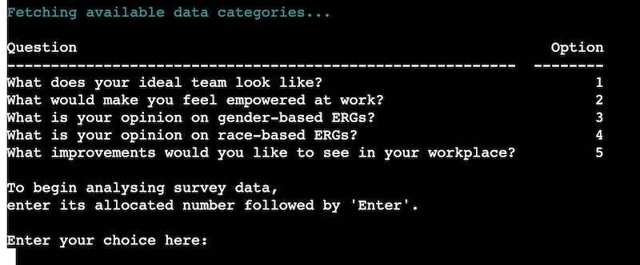
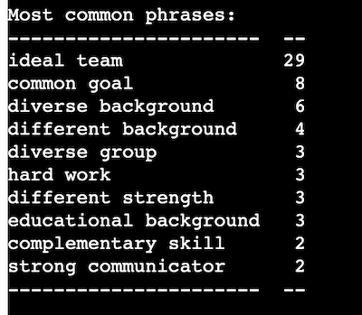
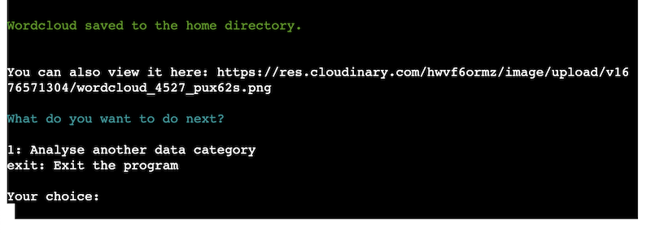
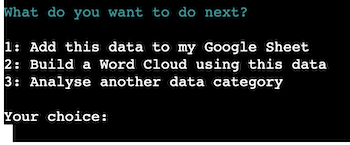
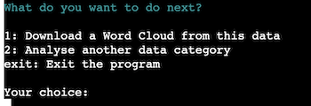
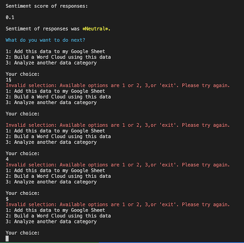

# Survey Sentiment Analyzer 

The Survey Sentiment Analyzer is a Python script that analyses survey data for sentiment and provides visual representations of the analysed data. This script allows users to connect to their Google Sheet data, fetch a specific category of data, analyse it for sentiment, and choose to either add the analysed data to their Google Sheet or visualise the data in a word cloud.

It’s designed to use basic natural language processing (NLP) techniques to analyze open-text data, particularly from open-ended questions in surveys. The application connects to Google Drive and Sheets via API, and is designed to help the user interact and understand survey responses at a high level, as well as export the data and wordcloud to use in stakeholder reports or anywhere else they may want to visually present the data.

I created this app to solve a problem I personally face often at work when analyzing such data. I’ve spent hours poring over open text survey data, trying to decipher common themes by reading alone. Equally, I can’t paste the data into an external text analysis service or word cloud maker, as it’s considered sensitive company data.

This app (if deployed on an employer’s IT-approved platform, or run locally on the user’s machine) helps users circumvent such data confidentiality concerns, and save hours on trying to read and understand bodies of open text data. 

[Link to live app](https://survey-sentiment-analysis.herokuapp.com/)

[Link to GitHub repo](https://github.com/h-bails/survey-sentiment-analysis)

[Link to Google sheet](https://docs.google.com/spreadsheets/d/1wTOMLC8k9bOKSgUdTgufXm1g1W1R7Ayw7DaTJpv5dys/edit#gid=0)


## User Stories

As a user, I want to be able to:
- View categories of data available for analysis
- Select a category/question I want to perform data analysis on
- Glean insights into the responses, such as most common words and phrases
- Get an idea as to the overall sentiment of the responses
- Export the raw textual data into a Google Sheet
- Export the most common phrases into a word cloud to visually represent the data

Additionally, any user of this application should find the menu system easy to navigate, and be able to exit the application or return to the main menu as they please.

## Flowchart


## Features

### The raw data


Above is an example of an optimised Google Sheet layout for this project. **Note:** The program assumes that the open text data to be analyzed has been sorted into separate columns depending on the question/theme, and that descriptive headers have been added. It also looks for the worksheet named *data* to fetch the data, so make sure to name your worksheet accordingly.

Currently, it is not within the scope of the program to analyze data that is not free text in nature (such as multiple choice or yes/no questions).

### Welcome message


The welcome message is displayed when the user first logs into the program, as well as when they choose to return to the home screen to analyze another category of data. It briefly introduces the program and instructs them on how to exit the program.

### Data selection


The available data is fetched from the Google Sheet, and is displayed according to the header title. Each category is allocated a number to help the user select the topic of their choice.

### Preparing the data for analysis


After the user selects a topic, the data is parsed and converted to one long string for analysis. 

### Displaying data insights




Using the spacy module, the most common words and phrases occurring in the body of data are displayed. In order to do this, the string is lemmatized (i.e. words are reduced to their base forms - e.g. 'likes' to 'like', 'change/changes/changing' to 'change'), and stop words are removed (such as 'is', 'to', 'and' etc.). This gives valuable insight as to what is on respondents' minds when answering a survey. 

The textblob module also analyzes the original (unlemmatized) string and assigns it a sentiment score. Using the program's inbuilt logic, a message is displayed to the user as to whether the sentiment was positive, negative or neutral.

### Adding data to the Google Sheet


Should the user opt to do so, the data can be appended to their Google Sheet. A new worksheet is created with a random name, and the data is tabulated within it.

### Building a Word Cloud


Using the wordcloud module, the lemmatized string is translated into a WordCloud. The WordCloud is saved to the /'static/' folder in the home directory using the wordcloud.to_file functionality, so that it can be converted into an image. If deployed locally on the user's machine, the wordcloud can be synced directly to either Google Drive or another cloud storage service. 
**An important caveat applies to WordClouds when project is deployed in Heroku - see Enhancements section below.**


### User prompts





After each stage (Data insights shown; Data added to Google sheet; Wordcloud built) the user is shown a menu of prompts displaying the next steps available to them, as illustrated in the flow diagram above. They can also exit the program at any time by typing 'exit'. The user's responses are validated and error handling is built in at each prompt screen.


## Future Implementations

In its current state, this script has proved highly useful to me so far, and I daresay it could be for other users too - **if** used on their local machine. 

However, for the purposes of this particular project, it was a requirement that the script be deployed to Heroku and interacted with in a front-end terminal. In its deployed state in Heroku, it should be considered a MVP, demonstrating what is possible with this script and these modules. 

The reason for this: I faced significant barriers in handling the processing and storage of the WordCloud images when deploying this project to Heroku (as you'll be able to tell by the commit history :'))

I was able to achieve the following working when running the program locally:
- Syncing of the WordCloud to Google Drive via the terminal (demonstrated in [this public folder](https://drive.google.com/drive/u/0/folders/1-cQa-pHMMvONbx9cra2l2aeWXntlce5N))
- Syncing of the WordCloud to Cloudinary via the terminal

The Wordcloud module works as follows: It uses matplotlib to 'plot' the words, however it does not automatically generate the wordcloud as an image. As far as I could tell, the wordcloud needs to be saved to the home directory as an image (using the .to_file function) in order for a cloud service to then accept its upload via their API.

However, Heroku uses an [ephemeral file system](https://devcenter.heroku.com/articles/dynos#ephemeral-filesystem) and is not designed for hosting or processing static images. So when attempting to fetch the image from the home directory, one is met with a 404 error.

I did try using _pathlib_ and _os_ to generate a dynamic directory path from Heroku, but to no avail at time of publication.

**In summary:** In an ideal world, this application would generate the worldcloud and upload it to a cloud service in real time. For the purposes of this project, I was not able to implement this. However, to work around this, and to demonstrate how the application *should* theoretically work and flow, I implemented the code to instead show a static, pre-uploaded set of wordclouds based on the example Google Sheet data in my project. This admittedly inelegant solution will obviously need to be altered if a user wants to deploy the project themselves!

Overall, I think the WordCloud module would likely be better suited to a tool like Jupyter Notebook, or perhaps in a full-stack project using Django or Flask, allowing for a wider set of features than Python + terminal alone.

### Other future enhancements

I'd also like to implement the following in future releases of this program:
- A trackable Net Promoter Score gleaned from the sentiment analysis that can be tracked over time
- Ability to glean insights from other types of survey data (multiple choice, numerical, yes/no, etc)
- When selecting 'Analyse another data category', it would probably be preferable for the user to navigate back to the list of headers rather than relaunching the whole program. This will be updated in a future release.

## Demo

Here is a short demo of the app and its functionality:


## Fixed bugs

- Initially, Heroku was giving the following error message when compiling the program for deployment:
```
fatal error: longintrepr.h: No such file or directory
```
- This was an issue between the Wordcloud module and Python 3.11 (which Heroku uses by default), and was rectified by specifying an earlier version of Python (3.9) in the runtime.txt folder.
- Linters Pylint and flake8 persistently flagged an error when importing Spacytextblob, stating the module wasn't used in the code, when it is in fact used in the 'analyze_themes' function (as _.blob). This was rectified by adding the following comments to the import line:
```
# noqa # pylint: disable=unused-import 
```
- I experienced an issue where the wordcloud couldn't be built after the data was appending to the Google Sheet. This is because I was accidentally passing a tuple as a parameter to the build_word_cloud() function instead of a string. This was patched.

## Run Locally

For the time being, I'm deliberately only include instructions to run this project locally, as I believe this will be most beneficial to potential users of this code. Future releases will incldue instructions on how to deploy using Heroku once the image hosting/processing issue is resolved.

### Requirements
To use this script, you'll need the following:

- Python 3.6 - 3.10 (WordCloud doesn’t play nicely with 3.11 yet)
- pip
- A Google account
- A Google Sheet containing the data you wish to process
- A Google Cloud Platform (GCP) project with the Google Drive and Google Sheets APIs enabled
- A GCP service account key file with the appropriate API permissions (see below)
- The appropriate Python packages (see below)

### Installation
1. Clone the repository to your local machine:
```
git clone https://github.com/example/survey-sentiment-analyzer.git
```
2. Install the required packages:
```
pip install -r requirements.txt
```
### Configuring the script
Before you can run the script on your local machine, you'll need to configure it to use your own Google Sheet and API credentials.

1. Identify the Google sheet which contains the data. The worksheet name should be *data*, and the relevant open text data should: (a) be sorted into separate columns depending on the question/theme, (b) have descriptive headers added to the top row for each different topic. See screenshot in the 'Raw data' section above for reference.

2. Go to the [GCP Console](https://console.cloud.google.com/), and create a new project.

3. Enable the Google Drive and Google Sheets APIs for your project.

4. Create a new service account for your project and download the service account key file as a JSON.

5. Grant the service account _Editor_ access on the Google Sheet and Drive APIs.

6. Add the downloaded service account key file to the root directory of the cloned repository, and rename it to "creds.json". 

7. Open "run.py" with your editor of choice, and replace the SHEET_NAME variable with the name of the Google Sheet you created in step 1.

8. Remove this snippet of code from run.py (lines 235 - 244):
```
short_path = 'https://res.cloudinary.com/hwvf6ormz/image/upload/'

    if header_choice == "1":
        wordcloud_url = short_path + "v1676571064/wordcloud_7289_y9dtvm.png"
    elif header_choice == "2":
        wordcloud_url = short_path + "v1676571249/wordcloud_7156_hukmw2.png"
    elif header_choice == "3":
        wordcloud_url = short_path + "v1676571304/wordcloud_4527_pux62s.png"
    elif header_choice == "4":
        wordcloud_url = short_path + "v1676571438/wordcloud_4473_f9nfuw.png"
    elif header_choice == "5":
        wordcloud_url = short_path + "v1676571487/wordcloud_6742_b0jpg4.png"
```
Also remove this snippet from line 247:
```
    print(f"\nYou can also view it here: {wordcloud_url}\n")
```

8. Save and close the "run.py" file.

### Running the script
To run the script, navigate to the root directory of the cloned repository in your terminal or CLI and enter the following command:
```
python survey_sentiment_analyzer.py
```
Follow the prompts in the terminal as described in the flowchart and Features section above.

Note: If you so desire, you can check out [this article](https://www.projectpro.io/recipes/upload-files-to-google-drive-using-python) on how to edit the code so the Wordclouds can be synced to your own Google Drive.


## Testing

### Functionality testing

| Description | Action | Expected outcome | Actual outcome |
|-----------------------------------------------------------------|-----------------------------------------------------------------|-----------------------------------------------------------------|----------------|
| Welcome Message displays on initial load. | Launch and/or reload live application. | Application should print the relevant welcome message upon initial load. | Pass |
| Any input screens should only accept valid inputs. | Try a range of valid and invalid inputs at all multiple choice inputs. Invalid inputs include a space, special characters, strings/integers not in list of options. | Program should only accept a string that corresponds to available options. | Pass |
| Valid inputs should display the correct option. | Enter valid inputs at various decision points. | Application should use the entered information correctly (e.g. if user inputs "2", the application should run the option listed as "2"). | Pass |
| Functionality to analyze the survey data should work correctly. | Select a topic for data analysis. | Program should process the data and return the most common words, phrases, and a sentiment score. | Pass |
| Functionality to add analyzed data to a Google Sheet should work correctly. | Select 'Add this data to my Google Sheet.' | Program should append the analyzed data to the Google Sheet in a new worksheet, with a randomly generated name. | Pass |
| Functionality to build a Wordcloud should work correctly. | Attempt to use the 'Build a WordCloud' functionality. | WordCloud should be generated and saved to the home directory under a randomly generated name. URL to a downloadable WordCloud should be displayed to the user. | Pass, with conditions (see 'Future Enhancements') |
| User should be able to exit the program. | Attempt to exit the program at user decision points. | Program should terminate. | Pass |
| User should be able to navigate to the home screen to analyze a new data category. | Attempt to use the 'Analyze another data category' menu option. | Program should display the welcome message and prompt the user to begin data analysis. | Pass |


### Notes
- I passed the code through Pylint, flake8 and the CI linter on Heroku. Errors and warnings were fixed as they appeared such as unussed imports, indentation errors, line length errors, or whitespace errors.

- After deployment, the features were tested on Chrome, Firefox and Safari. The app worked as expected on Chrome and Firefox. _Functionality is currently not supported on Safari_ - user inputs are not accepted at all when using the Safari browser. I tried loading some other example Code Institute projects in Safari and experienced the same - so I suspect this is down to a compatibility issue with the mock terminal interface.

- Error handling was added to all inputs. Every input screen was tested using letters, numbers, special characters, and unpredictable inputs to ensure the input validation worked correctly.

- Note: The 'Welcome' screen will accept any input before the enter key is pressed, but makes no use of any additional input - only the Enter key is required to launch the program.

- WordCloud creation: This cannot be tested in Heroku itself, but wordclouds were successfully created in the home directory. I've pushed a few to the *static* folder to demonstrate this. 

- Appending data to Google Sheets: You can see via [this Google sheet](https://docs.google.com/spreadsheets/d/1wTOMLC8k9bOKSgUdTgufXm1g1W1R7Ayw7DaTJpv5dys/edit#gid=136824285) that this functionality works as expected.

### Testing demos and screenshots:

Here is a short demo as to how input validation and Google Sheets sync was tested on Heroku:


Here is a short demo as to how the WordCloud functionality was tested in Visual Studio:


Here are screenshots from input validation testing:





## Credits

### Resources and tutorials
 - Dummy dataset by [Chandler Nunez on data.world](https://data.world/chanalytics/female-empowerment-survey-data)
 - Tutorials on using Spacy for text analysis: [Roberto Rocha](http://robertorocha.info/using-nlp-to-analyze-open-ended-responses-in-surveys/) & [Programming Historian](https://programminghistorian.org/en/lessons/sentiment-analysis)
 - Making WordClouds in Python: [Towards Data Science](https://towardsdatascience.com/how-to-make-word-clouds-in-python-that-dont-suck-86518cdcb61f)
 - Even though I didn't end up using the functionality in the deployed version, I found [this tutorial](https://www.projectpro.io/recipes/upload-files-to-google-drive-using-python) helpful in learning how to upload wordclouds to Google Drive.
 - I also want to shout out to [Shabucky1812](https://github.com/Shabucky1812/DottiesDivineDoughnuts/blob/main/testing.md) for inspo on how to lay out a testing section that is actually visually pleasing.

### Python libraries and modules used

- _collections_ - to use Counter to count common words and phrases
- _random_ - to generate random names for the wordcloud files and google sheet worksheets
- _sys_ - to exit the program
- _gspread_ - to interact with the Google sheet
- _oauth2_ - to interact with Google Drive
- _tabulate_ - to display data in a table format in the terminal
- _spacy_ - to pull out common words and phrases
- _spacy.matcher_ - to find words/phrases matching a given definition
- _spacytextblob_ - to perform sentiment analysis
- _matplotlib_ - to plot the word cloud
- _wordcloud_ - to generate the word cloud

## About
This project was written by Holly Bailey - [link to GitHub.](https://github.com/h-bails)
